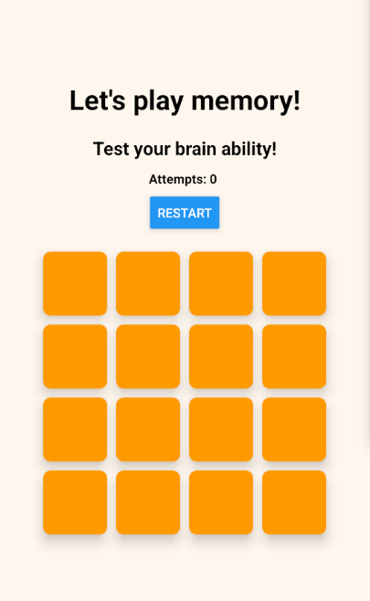
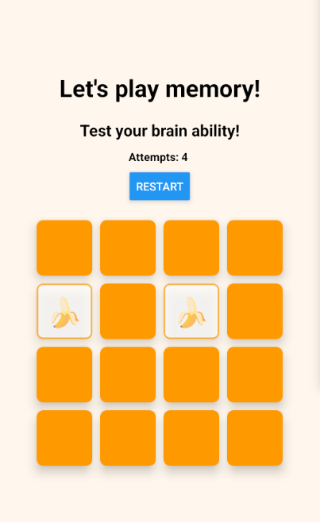

# ⚠️ About this repository ⚠️

This repository contains **multiple versions** of the classic Memory game, each developed with different technologies and organized into **separate branches**. 

Among the available versions, you will find a *Progressive Web App* (**PWA**) on **default branch** `pwa`, one built with ***React Native***, and another implemented using ***Flutter***.

*Check out the other branches to explore different versions of the game!*

The PWA linked to this repository (see it is only a partial PWA implementation because GitHub Pages does not support service workers. However, you can still open it in a Chromium-based browser and install it!

## Main Features

- **Dynamic grid**: The game features a 4x4 grid with 16 cards (8 pairs of emojis).
- **Random shuffling**: Cards are shuffled randomly at the start of each game, ensuring a unique experience every time.
- **Game mechanics**: Users can click on two cards to reveal them; if the cards match, they remain face up, otherwise they are flipped back after a short delay.
- **Restart button**: The game can be restarted at any time using the “Restart” button.
- **Status notifications**: The app notifies users of changes in network connectivity (online/offline).
- **Responsive interface**: The layout adapts to different screen sizes, making the game accessible on both desktop and mobile devices.

This application is designed to provide a simple, intuitive, and accessible gaming experience, challenging users’ memory skills in an engaging way.

## Memory Game *React-Native*

 

This repository contains an App implementation of the classic **Memory Game**, developed using  and  framework.

<p align="center">
  
  
</p>

## Getting Start

⚠️ Make sure you have already installed !

1. **Clone repo**: Firstly you have to clone this repo and select or check if you are on the right branch:
    ```
    git clone https://github.com/emanueletocci/memory-game
    cd memory-game
    git checkout react-native
    ```
2. **Install dependencies**: You must install all *js* dependencies using . 
Navigate to the project directory (you should see a file named *'package.json'*) and run:
    ```
    npm install
    ```
    Now you should have a new folder named *'node_modules'*.

3. **Run *Expo***: Launch a local development server using expo framework:
    ```
    npx expo start
    ```
4. **Switch to Expo Go**: By default expo uses a local development build that must be configured manually... I suggest to use **Expo Go** instead. You can switch to **expo go** simply pressing `s` letter on the keyboard. Now you can use a android/ios emulator, a simple web view or expo go **mobile app**.

Take a look to the expo enviroment . 
